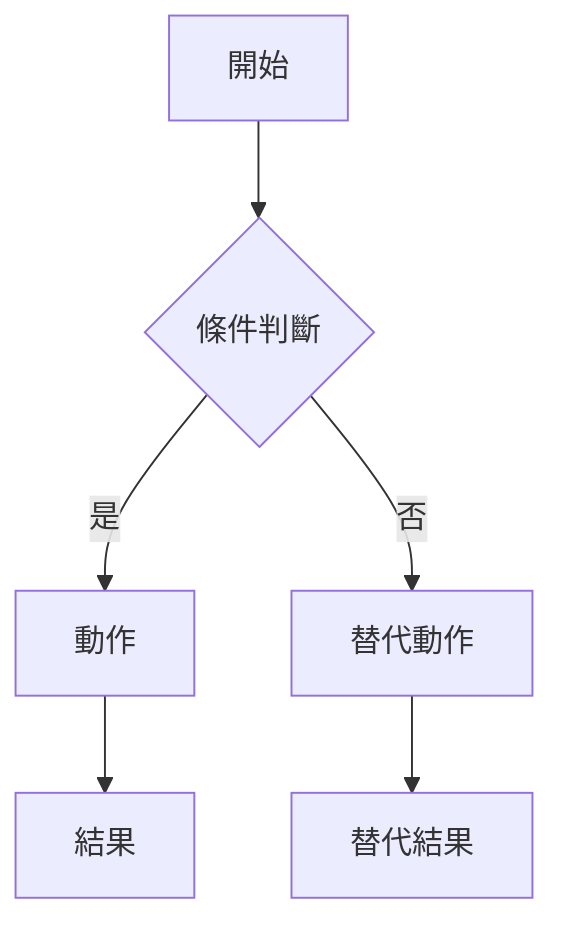

# Jira to Spec — 從 Jira Ticket 產出規格書

## 目標

當使用者輸入包含 `VIPOP-XXXXX` 格式的任務單號，並要求產出規格書時：

1. 透過 Atlassian MCP 拉取任務詳細資料
2. 若任務描述中含有 Axure / Figma 連結，透過 Playwright MCP 爬取規格書內容作為補充
3. 依據**規格書標準模板**產出完整 Markdown 文件

---

## 與 jira-analyzer 的分工

| Skill | 觸發條件 | 產出物 |
|-------|---------|--------|
| jira-analyzer | 使用者提到 VIPOP-XXXXX 且要求「分析」「評估」「看一下」 | 技術分析報告（難度、時間估算、風險點） |
| jira-to-spec | 使用者提到 VIPOP-XXXXX 且要求「規格書」「spec」「寫規格」 | 規格書標準模板格式文件 |

---

## 執行步驟

### Step 1：擷取任務單號

從使用者訊息中識別 `VIPOP-\d+` 格式的任務單號。

### Step 2：取得 Jira 任務資料

使用 Atlassian MCP 取得任務完整資料：

```
工具：Atlassian:getJiraIssue
參數：
  cloudId: "3b735765-d212-40c4-acb7-0aa53cf89612"
  issueIdOrKey: "{擷取到的單號}"
  responseContentFormat: "markdown"
```

擷取以下欄位（若存在）：
- `summary`：任務標題
- `description`：任務描述（核心資訊來源）
- `issuetype`：任務類型（Bug / Story / Task / Sub-task）
- `status`：目前狀態
- `priority`：優先級
- `assignee`：負責人
- `reporter`：回報者（通常是 PM/PO）
- `labels`：標籤
- `components`：影響元件
- `fixVersions`：目標版本
- `duedate`：截止日期
- `subtasks`：子任務
- `issuelinks`：相關連結
- `parent`：父任務（Epic）
- `customfield_*`：自訂欄位（Sprint、Story Points 等）
- `attachment`：附件（可能含規格書連結）
- `comment`：留言（可能含補充需求或規格書連結）

### Step 3：偵測規格書連結（選擇性）

掃描 `description`、`comment`、`attachment` 中的 URL：
- 含 `axshare.com` → Axure 規格書
- 含 `figma.com` → Figma 設計稿

若偵測到規格書連結，且 Playwright MCP 可用：
1. 嘗試爬取規格書內容作為補充資訊
2. 若爬取失敗（需登入、頁面不可讀等），**不中斷流程**，在規格書的「參考資料」區塊標註連結即可

> ⚠️ 與 jira-analyzer 不同：此 skill 爬取規格書失敗時**不終止**，因為主要資訊來源是 Jira ticket 本身。

### Step 4：判斷需求類型並填充模板

根據 Jira 任務內容，判斷需求的 `scope` 和 `type`：

**scope 判斷規則：**
| 條件 | scope |
|------|-------|
| 修改文案、調整版面、小幅 UI 調整 | patch |
| 新增功能、大幅改動流程 | feature |
| 移除功能或頁面 | removal |
| 純追蹤埋點、GA 事件 | tracking |

**type 判斷規則：**
| 條件 | type |
|------|------|
| 純文案/版面改動 | content |
| 涉及操作流程、按鈕行為 | interaction |
| 涉及角色權限判斷 | permission |
| 純 GA/NCC 埋點 | ga |
| 純版面重排 | layout |
| 以上多項混合 | mixed |

### Step 5：產出規格書

依照下方**規格書模板**填充內容，遵循以下原則：

1. **忠實呈現 Jira 內容**：不捏造資訊，Jira 未提及的部分用 `⚠️ Jira 未提及，建議與 PM 確認` 標註
2. **智慧填充**：根據任務描述合理推斷 User Stories、Use Cases、影響範圍等
3. **選擇性區塊**：Section 7（規格）的子區塊只填入與此任務相關的，不相關的整段省略
4. **主動補充例外情境**：Section 9 根據需求類型主動思考邊界情況
5. **Use Case 搭配流程圖**：Section 4 的每個 Use Case 都要附上 Mermaid 流程圖
6. **前端視角**：所有分析以前端工程師角度出發

### Step 6：輸出

1. 直接在對話中輸出完整 Markdown 規格書
2. **同時生成完整的 HTML 版規格書**（見下方「HTML 規格書生成」），將所有文字內容與 Mermaid 流程圖渲染在同一個頁面中

---

## HTML 規格書生成

規格書產出後，自動將整份 Markdown 內容轉為一個自包含的 HTML 檔案。

**生成規則：**
- 將規格書的所有 Markdown 內容（標題、段落、表格、列表、程式碼區塊等）轉為對應的 HTML 標籤
- Mermaid 區塊用 `<pre class="mermaid">` 包裹，由 Mermaid.js CDN 即時渲染為流程圖
- 表格轉為 `<table>` 並套用樣式
- Front matter（id, title, scope 等）轉為頁首的 metadata 資訊卡
- 檔名：`{ISSUE_KEY}-spec.html`

**轉換對照：**

| Markdown 語法 | HTML 輸出 |
|--------------|----------|
| `## 標題` | `<h2>標題</h2>` |
| `### 子標題` | `<h3>子標題</h3>` |
| 段落文字 | `<p>文字</p>` |
| `- 列表項` | `<ul><li>列表項</li></ul>` |
| `1. 有序列表` | `<ol><li>有序列表</li></ol>` |
| `\| 表格 \|` | `<table>...</table>` |
| `` ```mermaid `` | `<pre class="mermaid">...</pre>` |
| `**粗體**` | `<strong>粗體</strong>` |
| `` `行內代碼` `` | `<code>行內代碼</code>` |
| `⚠️ 提示文字` | `<div class="warning">⚠️ 提示文字</div>` |
| `- [ ] 驗收項` | `<input type="checkbox" disabled> 驗收項` |

**HTML 骨架模板：**

```html
<!DOCTYPE html>
<html lang="zh-TW">
<head>
  <meta charset="UTF-8">
  <meta name="viewport" content="width=device-width, initial-scale=1.0">
  <title>{ISSUE_KEY} 規格書</title>
  <script src="https://cdn.jsdelivr.net/npm/mermaid@11/dist/mermaid.min.js"></script>
  <style>
    * { margin: 0; padding: 0; box-sizing: border-box; }
    body {
      font-family: -apple-system, BlinkMacSystemFont, "Segoe UI", Roboto, sans-serif;
      background: #f8f9fa;
      color: #1a1a1a;
      line-height: 1.7;
      padding: 2rem;
      max-width: 960px;
      margin: 0 auto;
    }

    /* Meta card */
    .spec-meta {
      background: #fff;
      border: 1px solid #e0e0e0;
      border-radius: 8px;
      padding: 1.25rem 1.5rem;
      margin-bottom: 2rem;
      display: grid;
      grid-template-columns: repeat(auto-fill, minmax(200px, 1fr));
      gap: 0.5rem 2rem;
    }
    .spec-meta .meta-item { font-size: 0.85rem; color: #555; }
    .spec-meta .meta-item strong { color: #1a1a1a; }

    /* Headings */
    h1 { font-size: 1.6rem; margin-bottom: 0.25rem; }
    h2 {
      font-size: 1.3rem;
      margin: 2.5rem 0 1rem;
      padding-bottom: 0.4rem;
      border-bottom: 2px solid #e0e0e0;
    }
    h3 { font-size: 1.1rem; margin: 1.5rem 0 0.75rem; }

    /* Content */
    p { margin-bottom: 0.75rem; }
    ul, ol { margin: 0.5rem 0 1rem 1.5rem; }
    li { margin-bottom: 0.35rem; }
    code {
      background: #f0f0f0;
      padding: 0.15rem 0.4rem;
      border-radius: 3px;
      font-size: 0.9em;
    }

    /* Tables */
    table {
      width: 100%;
      border-collapse: collapse;
      margin: 1rem 0;
      font-size: 0.9rem;
    }
    th, td {
      border: 1px solid #ddd;
      padding: 0.5rem 0.75rem;
      text-align: left;
    }
    th { background: #f5f5f5; font-weight: 600; }
    tr:hover { background: #fafafa; }

    /* Mermaid diagrams */
    .mermaid {
      background: #fff;
      border: 1px solid #e8e8e8;
      border-radius: 8px;
      padding: 1.5rem;
      margin: 1rem 0;
      text-align: center;
    }

    /* Warning callouts */
    .warning {
      background: #fff8e1;
      border-left: 4px solid #ffc107;
      padding: 0.75rem 1rem;
      margin: 0.75rem 0;
      border-radius: 0 4px 4px 0;
      font-size: 0.9rem;
    }

    /* Checkbox */
    input[type="checkbox"] { margin-right: 0.5rem; }

    /* Footer */
    .spec-footer {
      margin-top: 3rem;
      padding-top: 1rem;
      border-top: 1px solid #e0e0e0;
      font-size: 0.8rem;
      color: #888;
    }
  </style>
</head>
<body>

  <h1>📋 {ISSUE_KEY} — {title}</h1>

  <div class="spec-meta">
    <div class="meta-item"><strong>Scope：</strong>{scope}</div>
    <div class="meta-item"><strong>Type：</strong>{type}</div>
    <div class="meta-item"><strong>Source：</strong>jira</div>
    <div class="meta-item"><strong>Created：</strong>{created}</div>
    <div class="meta-item"><strong>Deadline：</strong>{deadline}</div>
    <div class="meta-item"><strong>Related：</strong>{related}</div>
  </div>

  <!-- 以下為規格書各 Section 的 HTML 內容 -->
  <!-- 將每個 Section 的 Markdown 轉為對應的 HTML 標籤 -->
  <!-- Mermaid 區塊直接用 <pre class="mermaid"> 包裹 -->

  <div class="spec-footer">
    <p>規格書產生時間：{timestamp}</p>
    <p>資料來源：Jira {ISSUE_KEY}</p>
    <p>產生方式：jira-to-spec skill 自動產出，內容需經 PM/PO 確認</p>
  </div>

  <script>
    mermaid.initialize({
      startOnLoad: true,
      theme: 'default',
      flowchart: { useMaxWidth: true, htmlLabels: true }
    });
  </script>
</body>
</html>
```

**輸出方式：**
- 在 Claude Code 中：將 HTML 寫入 `{ISSUE_KEY}-spec.html`，完成後提示使用者 `open {ISSUE_KEY}-spec.html` 即可在瀏覽器完整預覽規格書
- 在 Claude.ai 中：建立 HTML 檔案並提供下載

---

## 規格書模板

```markdown
---
id: {ISSUE_KEY}
title: {summary}
scope: {patch | feature | removal | tracking}
type: {content | interaction | permission | ga | layout | mixed}
source: jira
created: {今天日期 YYYY-MM-DD}
deadline: {duedate，若無則刪除此行}
related: [{相關 ticket 列表}]
---

## 1. 背景

{根據 Jira description 描述為什麼要做這件事。
包含商業動機、用戶回報、事件起因。
若 Jira 描述不足，標註「⚠️ 背景資訊不足，建議與 PM/PO 確認」}

## 2. 目標

{用「用戶能...」或「營運能...」的句型描述目標。
不描述技術實作，聚焦在用戶價值或營運價值。}

### 成功指標

{若 Jira 有提及 KPI 或量化目標則填入，否則刪除此子區塊}

| 指標 | 目前 | 目標 |
|------|------|------|
| | | |

## 3. User Stories

{從 Jira 描述中提煉 User Stories}

- 身為 {角色}，我想要 {做什麼}，以便 {達成什麼目的}

## 4. Use Cases

{根據 Jira 描述建立 Use Cases，每個 UC 都要包含完整結構}

### UC-1: {Use Case 名稱}

**主要角色**：{誰在操作}
**前置條件**：{開始前必須滿足什麼}
**後置條件（成功）**：{完成後系統處於什麼狀態}
**後置條件（失敗）**：{失敗後系統處於什麼狀態}

**主要流程**：
1. 用戶 {動作}
2. 系統 {回應}
3. ...

**替代流程**：
- 2a. 若 {條件}：系統 {替代回應} → 回到步驟 {N} / 結束

**流程圖**：


## 5. 影響範圍

### 受影響的角色

| 角色 | 影響方式 |
|------|---------|
| | |

### 受影響的頁面 / 功能

| 頁面名稱 | 頁面路徑 | 異動類型 |
|---------|---------|---------|
| | | 新增 / 修改 / 移除 |

### 這次不改

| 不改的項目 | 原因 |
|-----------|------|
| | |

## 6. 權限設計

{若此需求涉及權限判斷才填入，否則寫「本次需求不涉及權限變更」}

### 角色權限矩陣

| 角色 | 進入頁面 | 使用功能 | 查看資料 | 操作資料 | 未滿足時行為 |
|------|:-------:|:-------:|:-------:|:-------:|------------|
| | | | | | |

### 權限檢查時機

| 檢查點 | 檢查內容 | 不通過時行為 |
|--------|---------|------------|
| | | |

## 7. 規格

{根據需求類型，只填入相關的子區塊，不相關的整段省略。
以下子區塊全部為選填，依需求挑選：}

{此處根據 Jira 內容動態選擇需要的子區塊填入。
可能的子區塊包含：文案/版面異動、操作流程、提示與文案、商業規則、
狀態變化、功能移除、頁面結構、表單、列表/搜尋結果、追蹤埋點、
通知/信件、既有頁面調整。
每個子區塊的格式參照規格書標準模板。}

## 8. 錯誤處理

### 頁面層級錯誤

| 錯誤情境 | 用戶看到什麼 | 用戶可以做什麼 |
|---------|------------|-------------|
| | | |

### 操作層級錯誤

| 操作 | 錯誤情境 | 錯誤提示（文案） | 提示方式 | 用戶可以做什麼 |
|------|---------|---------------|---------|-------------|
| | | | | |

## 9. 例外情境

{AI 根據需求類型主動補充極端操作與邊界情況}

| # | 情境分類 | 情境描述 | 預期行為 |
|---|---------|---------|---------|
| 1 | | | |

## 10. 驗收標準

{按 Use Case 分組，用「用戶可以...」或「當...時，應...」的句型}

### UC-1 相關
- [ ] 

### 權限相關
- [ ] 

### 錯誤處理相關
- [ ] 

### 通用
- [ ] 

## 11. 上線注意事項

{選填。有時間相依、開關、前後端配合等注意事項時填入，否則刪除此 section}

## 12. 參考資料

| 類型 | 連結 |
|------|------|
| Jira | https://104corp.atlassian.net/browse/{ISSUE_KEY} |
| Figma | {若有} |
| 規格書 | {若有 Axure/Figma 連結} |
| 相關 Spec | {若有相關 ticket} |

---

*規格書產生時間：{timestamp}*
*資料來源：Jira {ISSUE_KEY}*
*產生方式：jira-to-spec skill 自動產出，內容需經 PM/PO 確認*
```

---

## Section 7 子區塊選擇指引

根據需求 `scope` 和 `type` 決定填入哪些子區塊：

| scope / type | 建議填入的子區塊 |
|-------------|----------------|
| patch + content | 文案/版面異動 |
| patch + interaction | 操作流程、提示與文案 |
| patch + ga | 追蹤埋點 |
| feature + interaction | 操作流程、提示與文案、頁面結構、表單、列表/搜尋結果 |
| feature + permission | 操作流程、商業規則、狀態變化 |
| feature + mixed | 視內容組合，可能全部都需要 |
| removal | 功能移除 |
| tracking | 追蹤埋點 |

> 這是指引而非硬規則，實際應根據 Jira 內容判斷。

---

## 注意事項

- 語言：**中文為主，技術術語 / 路徑 / 元件名稱維持原文**
- 資訊不足時誠實標註 `⚠️`，**絕對不捏造**
- Section 7 子區塊只填有意義的，不要為了模板完整性而填空殼
- Use Case 的流程圖使用 Mermaid `flowchart TD` 格式
- 狀態變化用 Mermaid `stateDiagram-v2` 格式
- 產出的規格書是 **v1 草稿**，末尾提醒使用者需與 PM/PO 確認後才算定稿
- 若 Jira ticket 類型是 Bug，提示使用者「Bug 類型的票通常不需要完整規格書，建議改用 jira-analyzer 進行分析」
- **HTML 規格書**：每次產出規格書時，一律同時生成完整的 HTML 版本（含文字內容 + Mermaid 流程圖渲染），檔名為 `{ISSUE_KEY}-spec.html`

---

## 範例觸發語句

以下訊息應觸發此 skill：

- `幫 VIPOP-44376 寫規格書`
- `把 VIPOP-1234 整理成規格書`
- `VIPOP-567 的 spec`
- `幫我產 VIPOP-890 的規格書`
- `VIPOP-2024 規格書產出`
- `這張票 VIPOP-111 要寫 spec`

以下訊息**不應**觸發此 skill（應觸發 jira-analyzer）：

- `分析 VIPOP-1234`
- `幫我看一下 VIPOP-567`
- `VIPOP-890 的難度評估`
